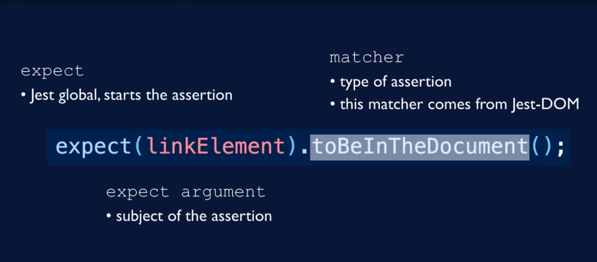

# Notes

- Assertions
  

- unit tests
  - tests one unit of code in isolation
- integration tests
  - how multiple units work together
- functional tests
  - testing a particular function of software
- acceptance/end-to-end tests
  - use actual browser and server (Cypress, Selenium)
